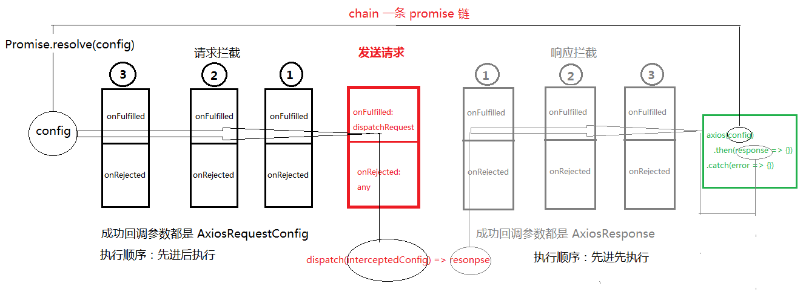

## 简介
*Promise based HTTP client for the browser and node.js* 

`Axios` 是基于 Promise 的 HTTP 客户端，支持在浏览器端和 node.js 中使用。

其本质就是一个函数，即 `Axios.prototype.request` 函数（绑定 `AxiosInstance` 后的），同时合并 `Axios.prototype` 和 `AxiosInstance` 对象上的属性和方法。该函数内部实例化了一个 `XMLHttpRequest` 对象，调用相关 `API` 实现请求和响应，最终返回一个 `promise` 对象。

## 准备工作

### 首先，前端用 `npx create-react-app axios-app --typescript` 生成一个 ts `react` 项目

### 接下来，搭建用 `node` 搭建一个后台服务器
```js
let express = require('express');
let bodyParser = require('body-parser');
let app = express();
app.use(bodyParser.json());
app.use(bodyParser.urlencoded({ extended: true }));
app.use(function (req, res, next) {
    res.set({
        'Access-Control-Allow-Origin': 'http://localhost:3000',// 设置跨越 react web服务器 端口号 3000
        'Access-Control-Allow-Credentials': true,
        'Access-Control-Allow-Methods': 'GET,POST, PUT, DELETE, OPTIONS',
        'Access-Control-Allow-Headers': 'Content-Type,name'
    });
    if (req.method === 'OPTIONS') return res.sendStatus(200);
    next();
});

app.get('/get', (req, res) => res.json(req.query));

app.post('/post', (req, res) => res.json(req.body));

app.post('/post_timeout', (req, res) => {
    let { timeout } = req.query;
    timeout = timeout ?  parseInt(timeout) : 0;
    setTimeout(() => res.json(req.body), timeout);
});

app.post('/post_status', (req, res) => {
    let { code } = req.query;
    code = code ? parseInt(code) : 200;
    res.statusCode = code;
    res.json(req.body);
});
app.listen(8000);
```

### `axios` 库实现前后端的交互

### 安装前后端需要的模块
- 前端库需要的模块
    - `qs` 调用 `qs.stringify(object)` 将参数 对象转为 查询字符串
    - `parseHeaders` 解析后端传入的请求头字符串 => 对象格式
- 后端
    - `express` 基于 `http` 实现的后端服务
    - `body-parser` 解析 json 请求体和表单请求体

```cmd
npx create-react-app axios-app
cd axios-app
yarn add axios qs parse-headers
yarn add express body-parser
```

## 使用 

发送 `get` 请求

```js
// index.js 文件
import axios from 'axios';

const user = {
    name: 'Stella',
    password: '123456',
}

const baseUrl = 'http://localhost:8000';

axios({
    url: `${baseUrl}/get`,
    params: user,
    method: 'get',
})
.then(response => console.log(response))
.catch(err => console.log(err))
```

## 实现

接下来，来分析分析 `axios` 调用过程以及 `.then` 成功回调中接收的相应结果，很显然这里的 `axios` 函数调用后返回的是一个 `promise` 对象

### 类型声明文件

index.d.ts
- `Cancel`：取消请求
```js
export class Cancel {
    constructor(public reason?: string){
    }
}
```

- `isCancel`：判断是否取消的函数
```js
export function isCancel(value: any): boolean {
    return value instanceof Cancel;
}
```

- `CancelToken`：基于 `Promise` 实现，将 `resolve` 函数调用赋给实例属性，成功状态改变交给了用户
```js
export class CancelToken {
    public resolve: any;

    source() {
        return {
            token: new Promise(resolve => this.resolve = resolve),
            cancel: (reason?: string) => this.resolve(new Cancel(reason))
        }
    }
}
```

- `Interceptor` 的两个参数，都为函数
```js
interface onFulfilled<V> {
   (value: V): V | Promise<V>
}

interface onRejected {
    (error: any): any
}
```
解析: `onFulfilled` 参数 `V` 类型 根据实例化的对象不同传入不同的参数， `request` 参数为 `AxiosRequestConfig` 统一对请求选项进行拦截处理， `response` 参数为 `AxiosResponse<T>` 

- `Interceptor`：拦截器
```js
export interface Interceptor<T = any> {
    onFulfilled?: onFulfilled<T>
    onRejected?: onRejected
}
```
解析：每个拦截器对象有两个属性，分别为成功和失败的函数，最终通过串行的方式给 `promise` 对象消费。

- `AxiosInterceptorManager`：`axios.interceptors.request` | `axios.interceptors.response` 的类
```js
export default class AxiosInterceptorManager<T> {
    public interceptors: Array<Interceptor<T> | null> = []
    // 每个拦截器都有两个参数， 成功的回调 和失败的回调
    use(onFulfilled?: onFulfilled<T>, onRejected?: onRejected): number {
        this.interceptors.push({
            onFulfilled,
            onRejected
        })
        return this.interceptors.length - 1;
    }

    eject(index:number): void {
        this.interceptors[index] && (this.interceptors[index] = null);
    }
}     
```
解析：
1. `interceptors`：数组类型，请求、响应的拦截通过调用 `use` 加入 `Interceptor` 类型，调用 `eject` 弹出加入的 `Interceptor` 类型为 null
2. `use`：向 `interceptors` 数组中添加一个 `Interceptor`，返回值为当前添加的下标 `interceptors.length - 1`
3. `eject`：接收要被弹出的 `Interceptor` 下标，将该下标在数组中对应的 `interceptor` 设置为 `null`


- `Interceptors`：拦截器类型
```ts
export interface Interceptors {
    request: AxiosInterceptorManager<AxiosRequestConfig>
    response: AxiosInterceptorManager<AxiosResponse>
}
```

- `axios` 请求方法及其器属性
```ts
export interface AxiosInstance {
  <T = any>(config: AxiosRequestConfig): Promise<AxiosResponse<T>>;
  interceptors: Interceptors;
  defaults: AxiosRequestConfig;
  CancelToken: CancelToken;
  isCancel(value: any): boolean;
  get<T, R = AxiosResponse<T>>(url: string, config?: AxiosRequestConfig): Promise<R>
}
```
逐一分析 `axios` 属性、方法
1. `<T = any>(config: AxiosRequestConfig): Promise<AxiosResponse<T>>`：请求函数，接收 `AxiosRequestConfig`，发送请求
2. `interceptors:`：拦截器，

- `AxiosRequestConfig` 请求配置选项类型

规定用户传入的参数可以是以下类型
```ts
export interface AxiosRequestConfig {
  url?: string;
  method?: Methods;
  params?: any,
  // params: Record<string, any>;
  headers?: Record<string, any>;
  data?: Record<string, any>;
  timeout?: number;
  transformRequest?: (requestData:any, headers: any) => any;
  transformResponse?: (responseData: any) => any;
  cancelToken?: Promise<any>; 
}
```
逐一分析下 `AxiosRequestConfig` 各个属性/ 方法的用途吧，划重点：这里传入的配置选项就是给 `XMLHttpRequest` 对象的（以下都用 `request` 简称）各种API使用哒
1. `url`: 请求路径的一部分 协议 + 域名 + 端口号
2. `method`: 请求的方法名
3. `params`: 请求路径的 查询字符串，调用 `qs.stringify()` 将对象类型的 `params` 转为字符串格式，如：
```js
传入的
params = {
    name: 'Stella',
    password: '123456',
}
格式化后：
params = 'name=Stella&password=123456';
```
4. `headers`: 请求头信息
5. `data`: 请求方法为 `POST` 时的请求体
6. `timeout`: 请求超时时长，用于超时的
```js
request.timeout = timeout;
request.onerror = function() {}
```
7. `transformRequest`: 这是一个用于转换请求的方法，接收两个参数，分别是用户传入的 `data` 和 `headers`，可对这个属性进行操作，返回值为处理后的 `data`

8. `transformResponse`: 这是一个用于转换响应的方法，接收的参数为请求响应 `response` 的完整结果，返回值为处理后的 `response` 
9. `cancelToken`: 这个不需要自己实现，值为 `axios.CancelToken.source().token`，就是一个 `Promise` 实例对象，在实例化的时候并没有立即让其状态 `state` 变为 `FULFILLED` 或 `REJECTED`，也就是没有执行 `resolve` |  `reject` `函数，而是将resolve` 函数赋值给了 `CancelToken` 实例的方法。用户可调用 `axios.CancelToken.source().cancel(reason)` 传入 `reason` 变为成功态 

- `AxiosResponse` 响应类型

接收泛型 `T`, 传入的动态数据类型会作为 `Promise` 类的执行器函数 `executor(resolve, reject)` 的第一个成功函数调用的参数，一旦变为成功态，`axios` 请求函数调用结果（就是刚才的 new 出来的 promise 对象），就能 `.then(onFulfilled)` 获取到哦
```ts
export interface AxiosResponse<T = any> {
  data: T;
  status: number;
  statusText: string;
  headers? : Record<string, any>;
  config?: AxiosRequestConfig;
  request?: XMLHttpRequest;
}
```

### src 目录下创建 axios 目录，新增文件
-  Axios.ts
```js
import { AxiosRequestConfig, AxiosResponse } from './types';
import AxiosInterceptorManager, { Interceptor, Interceptors } from './AxiosInterceptorManager';
import qs from 'qs';
import parseHeaders from 'parse-headers';

// merge options
const defaults: AxiosRequestConfig = {
  method: 'get',
  timeout: 0,
  headers: {
    common: { // 针对所有的请求生效
      accept: 'application/json', // 指定服务器返回 JSON 格式的数据
      name: 'Stella'
    },
  }
}

let getStyleMethods = ['get', 'head', 'delete', 'options'];
let postStyleMethods = ['put', 'post', 'patch'];
getStyleMethods.forEach((method: string) => (defaults.headers![method] = {}));
postStyleMethods.forEach((method: string) => (defaults.headers![method] = { 'Content-Type': 'application/json' }));
const allMethods = [...getStyleMethods, ...postStyleMethods];

export default class Axios<T> {
  public defaults: AxiosRequestConfig = defaults;
  public interceptors: Interceptors = {
    request: new AxiosInterceptorManager<AxiosRequestConfig>(),
    response: new AxiosInterceptorManager<AxiosResponse<T>>(),
  }

  request<T>(config: AxiosRequestConfig): Promise<AxiosRequestConfig | AxiosResponse<T>> {
    config.headers = Object.assign(this.defaults.headers, config.headers);
    if (config.transformRequest && config.data) {
      config.data = config.transformRequest(config.data, config.headers);
    }
    const chain: Interceptor[] = [{
      onFulfilled: this.dispatchRequest,
      onRejected: undefined,
    }]
    this.interceptors.request.interceptors.forEach(interceptor => {
      interceptor && chain.unshift(interceptor);
    })
    this.interceptors.response.interceptors.forEach(interceptor => {
      interceptor && chain.push(interceptor);
    })

    let promise = Promise.resolve(config);

    while (chain.length) {
      let { onFulfilled, onRejected } = chain.shift()!;
      promise = promise.then(onFulfilled, onRejected);
    }
    
    return promise;
  }

  dispatchRequest<T>(config: AxiosRequestConfig): Promise<AxiosResponse<T>> {
    return new Promise<AxiosResponse<T>>((resolve, reject) => {
      let { method= 'get', url, params, data, headers, timeout = 0 } = config;
      let request = new XMLHttpRequest();
      if (params && typeof params == 'object') {
        params = qs.stringify(params);
        url += ((url!.indexOf('?') === -1 ? '?' : '&') + params);
      }
      request.open(method, url!, true);
      request.responseType = 'json';
      request.onreadystatechange = function () { // h5 API request.onload readystate = 4 status = 200
        if (request.readyState === 4 && request.status !== 0) {
          if (request.status >= 200 && request.status < 300) {
            let response: AxiosResponse<T> = {
              data: request.response ? request.response : request.responseText,
              status: request.status,
              statusText: request.statusText,
              headers: parseHeaders(request.getAllResponseHeaders()),
              config,
              request,
            }
            if (config.transformResponse) {
              response = config.transformResponse(response);
            }
            resolve(response);
          } else {
            reject(new Error(`Request failed with status code ${request.status}`));
          }
        }
      }
      //  POST method
      // headers && Object.keys(headers).forEach(key => request.setRequestHeader(key, headers![key]));
      if (headers) {
        // headers:
        //   common: {accept: "application/json"}
        //   get: {}
        //   head: {}
        //   delete: {}
        //   options: {}
        //   put: {Content-Type: "application/json"}
        //   post: {Content-Type: "application/json"}
        //   patch: {Content-Type: "application/json"}
        Object.keys(headers).forEach(key => {
          if (key === 'common' || allMethods.includes(key)) {
            if (key === 'common' || key === config.method) {
              for (let key2 in headers![key]) request.setRequestHeader(key2, headers![key][key2]);
            }
          } else request.setRequestHeader(key, headers![key]);
        })
      }
      let body: string | null = null;
      if (data) {
        if (typeof data === 'object') body = JSON.stringify(data);
        else if (typeof data === 'string') body = data;
      } 
      /**
       * 错误处理
       *  - 网络异常 request.onerror
       *  - 超时异常 request.ontimeout
       *  - 错误状态码 request.status === 0
       */

      request.onerror = function() {
        reject(new Error(`net::ERR_INTERNET_DISCONNECTED`));
      }

      if (timeout) {
        request.timeout = timeout;
        request.ontimeout = function () {
          reject(new Error(`timeout of ${timeout}ms exceeded`))
        }
      }

      // cancelToken
      if (config.cancelToken) {
        config.cancelToken.then((reason: string) => {
            request.abort();
            reject(reason);
        });
      }

      request.send(body);
    })
  }

  get<T, R = AxiosResponse<T>>(url: string, config?: AxiosRequestConfig): Promise<AxiosRequestConfig | R> {
    config = {...config, url}
    return this.request<T>(config!);
  }
}
```

-  index.js
```js
import Axios from './Axios';
import { AxiosInstance } from './types';
import { CancelToken, isCancel } from './cancel';

function createInstance<T>(): AxiosInstance {
  let context: Axios<T> = new Axios();
  // 绑定 request this 永远指向当前实例
  let instance = Axios.prototype.request.bind(context);
  // 合并 Axios 原型对象 和 实例属性到 request 函数对象上。
  instance = Object.assign(instance, Axios.prototype, context);
  return instance as AxiosInstance;
}

let axios = createInstance();
axios.CancelToken = new CancelToken();
axios.isCancel = isCancel;

export default axios;
```

## 功能
### request 请求
### error handling 错误处理
### merge options 合并选项
### transform request & response 转换请求、 响应
### intercept request & response 拦截请求、响应

拦截器有两种情况:
可以多次调用 `.use`，
- 对请求的拦截 `axios.interceptors.request`
- 对响应的拦截 `axios.interceptors.response`

### cancel request 取消请求